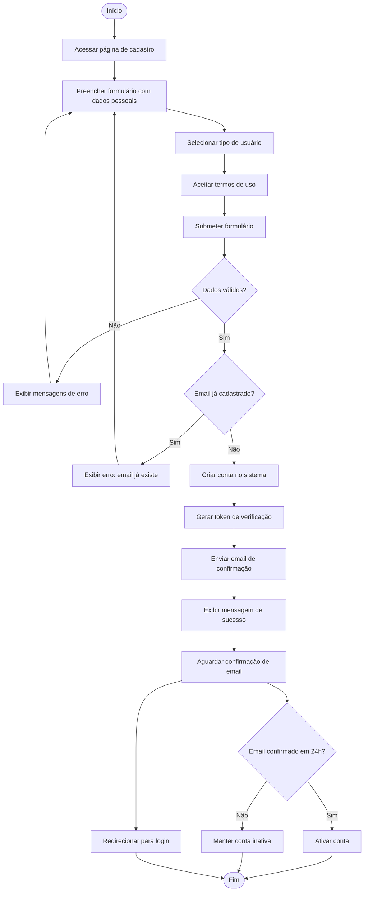

# Diagrama de Atividade
## Cadastro de Usuário

## Notas
- O usuário pode escolher entre Aluno, Monitor ou Coordenador
- A validação inclui: formato de email, força da senha, campos obrigatórios
- O token de verificação expira em 24 horas
- Contas não verificadas podem ser excluídas automaticamente após período de inatividade