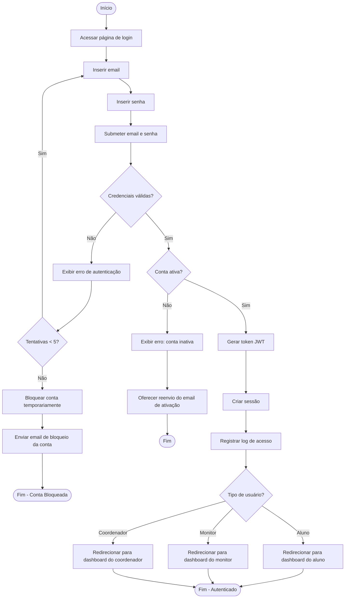

# Diagrama de Atividade
## Autenticação de Usuário

## Notas
- Após 5 tentativas falhas, a conta é bloqueada por 30 minutos
- O token JWT tem validade de 24 horas
- O sistema registra data, hora e IP de cada acesso
- Cada tipo de usuário é redirecionado para sua interface específica
