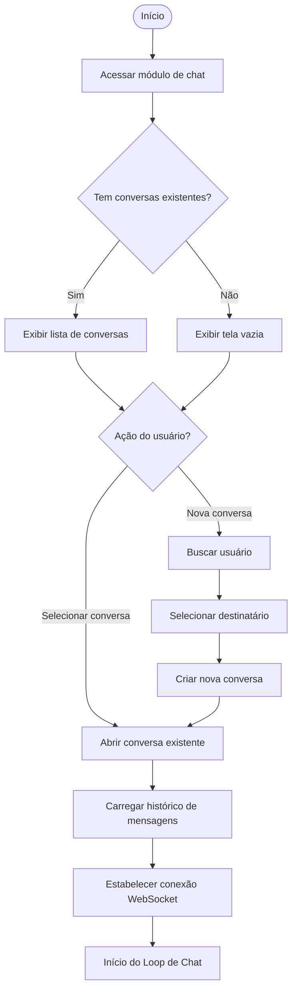
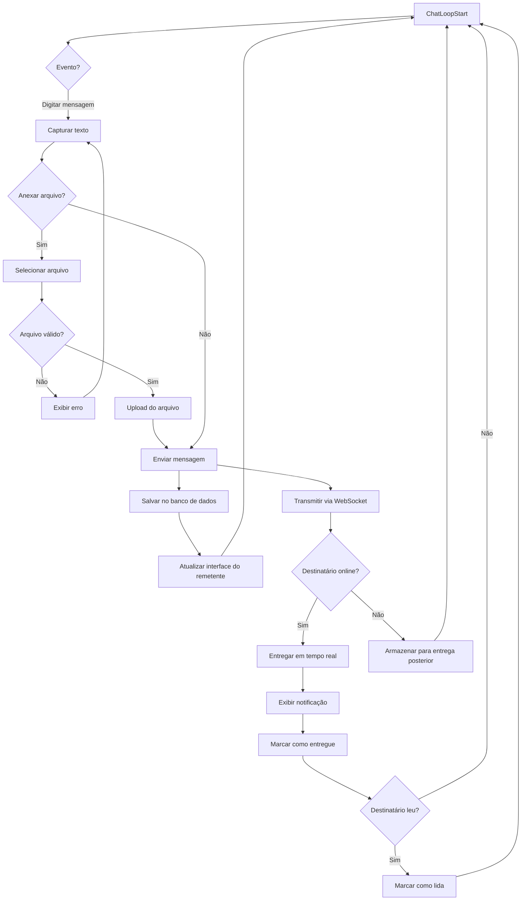
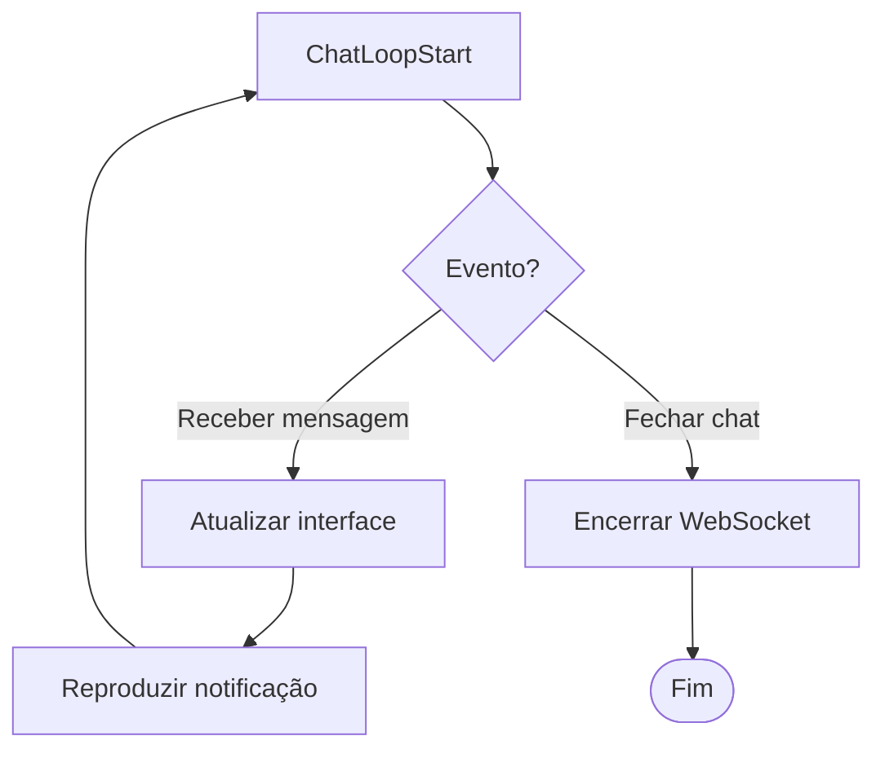

# Diagrama de Atividade
## Comunicação via Chat

## Acesso e abertura do chat

## Envio de Mensagens e status

## Recebimento de mensagens e encerramento 

## Notas
- Os diagramas foram separados para melhor vizualização 
- Suporte para mensagens de texto e arquivos (imagens, PDFs, até 10MB)
- Indicadores de status: enviado, entregue, lido
- Notificações em tempo real para mensagens recebidas
- Histórico completo de conversas mantido no banco de dados
- Conexão WebSocket para comunicação bidirecional em tempo real
