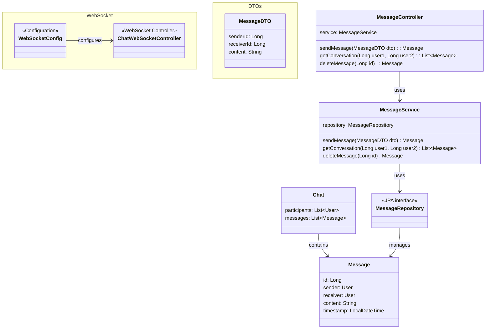

# Diagrama de Classes
## Chat Domain
**Casos de Uso Associados:** UC03;

**Funcionalidades:** envio e acesso a mensagens entre dois usuários.

```mermaid
classDiagram

    class Chat {
        participants: List~User~
        messages: List~Message~
    }

    class Message {
        id: Long
        sender: User
        receiver: User
        content: String
        timestamp: LocalDateTime
    }

    class MessageRepository {
        <<JPA interface>>
    }

    class MessageService {
        repository: MessageRepository
        sendMessage(MessageDTO dto) Message
        getConversation(Long user1, Long user2) List~Message~
        deleteMessage(Long id) Message
    }

    class MessageController {
        service: MessageService
        sendMessage(MessageDTO dto): Message
        getConversation(Long user1, Long user2): List~Message~
        deleteMessage(Long id): Message
    }

    namespace WebSocket {
        class ChatWebSocketController {
            <<WebSocket Controller>>
        }

        class WebSocketConfig {
            <<Configuration>>
        }
    }

    namespace DTOs {
        class MessageDTO {
            senderId: Long
            receiverId: Long
            content: String
        }
    }

    Chat --> Message : contains

    MessageController --> MessageService : uses
    MessageService --> MessageRepository : uses
    MessageRepository --> Message : manages

    WebSocketConfig --> ChatWebSocketController : configures


```