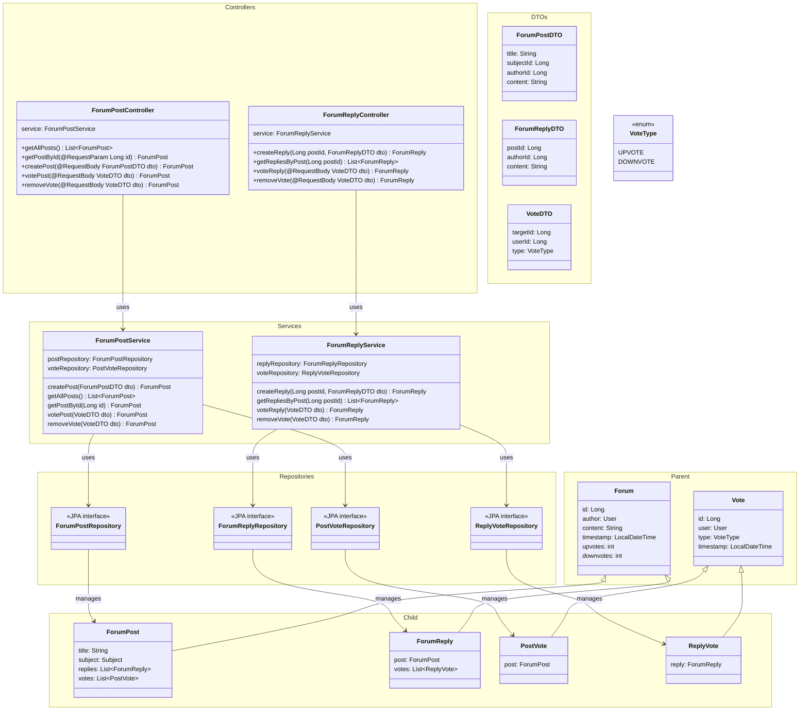

# Diagrama de Classe
## Fórum Domain

**Casos de Uso Associados:** UC04.1, UC04.4, UC04.3;

**Funcionalidades:** criação de posts e respostas; acesso ao fórum; upvotes e downvotes.

> [!NOTE]
> Algumas funções, como edição e deleção não serão implementadas nesse primeiro momento por uma dependência do Spring Security que ainda será abordada e trabalhada em sala de aula.

