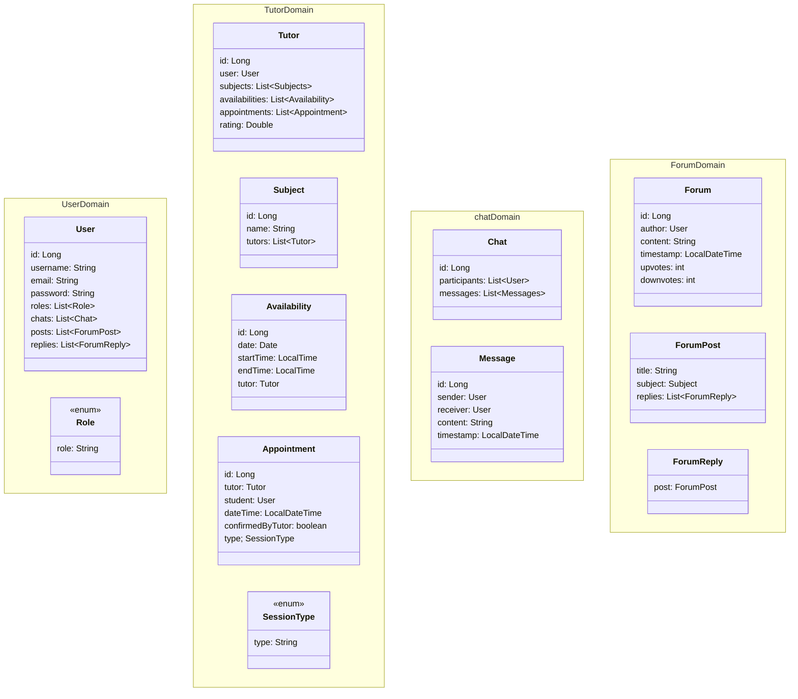

# Diagrama de Classes
## Models (Entidades Banco de Dados)

```mermaid
classDiagram

    namespace UserDomain {
        class User {
            id: Long
            username: String
            email: String
            password: String
            roles: List~Role~

            chats: List~Chat~
            posts: List~ForumPost~
            replies: List~ForumReply~
        }

        class Role {
            <<enum>>
            role: String
        }
    }

    namespace TutorDomain {
        class Tutor {
            id: Long
            user: User
            subjects: List~Subjects~
            availabilities: List~Availability~
            appointments: List~Appointment~
            rating: Double
        }

        class Subject {
            id: Long
            name: String
            tutors: List~Tutor~
        }

        class Availability {
            id: Long
            date: Date
            startTime: LocalTime
            endTime: LocalTime
            tutor: Tutor
        }

        class Appointment {
            id: Long
            tutor: Tutor
            student: User
            dateTime: LocalDateTime
            confirmedByTutor: boolean
            type; SessionType
        }

        class SessionType {
            <<enum>>
            type: String
        }
    }

    namespace chatDomain {
        class Chat {
            id: Long
            participants: List~User~
            messages: List~Messages~
        }

        class Message {
            id: Long
            sender: User
            receiver: User
            content: String
            timestamp: LocalDateTime
        }
    }

    namespace ForumDomain {
        class Forum {
            id: Long
            author: User
            content: String
            timestamp: LocalDateTime
            upvotes: int
            downvotes: int

        }

        class ForumPost {
            title: String
            subject: Subject
            replies: List~ForumReply~
        }

        class ForumReply {
            post: ForumPost
        }
    }

```