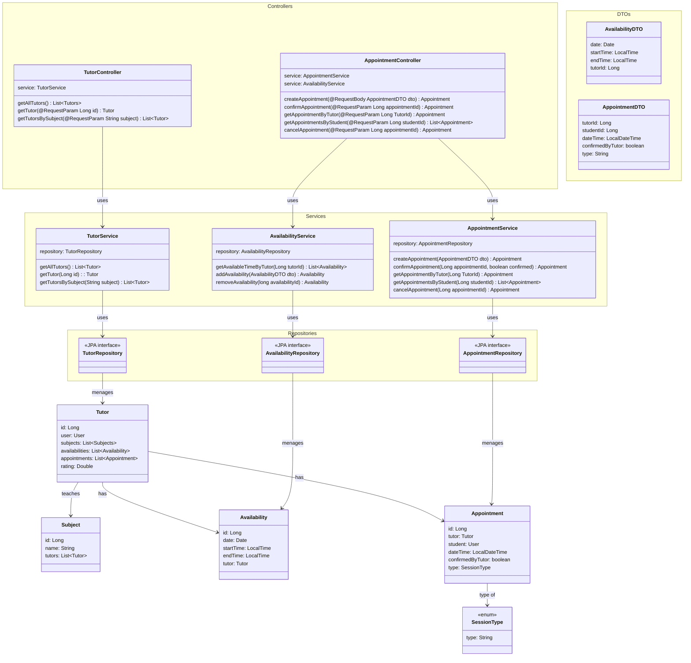

# Diagrama de Classe
## Tutor Domain

**Casos de Uso Associados:** UC05, UC06, UC07;

**Funcionalidades:** acessar perfil de tutores, acessar agenda de tutores, marcar datas de tutorias em uma agenda de tutor.

