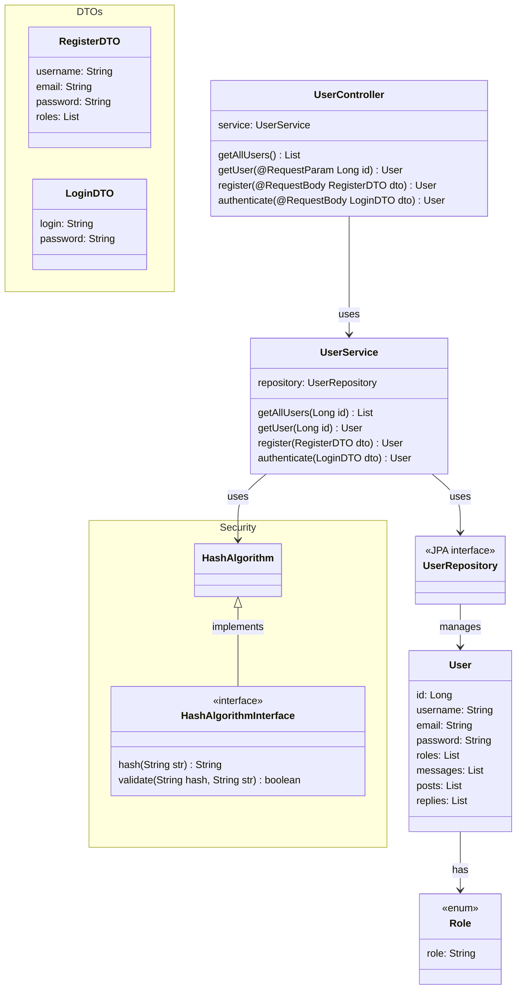

# Diagrama de Classes
## User Domain

**Casos de Uso Associados:** UC01, UC02;

**Funcionalidades:** cadastro e autenticação de usuários.

```mermaid
classDiagram

    class User {
        id: Long
        username: String
        email: String
        password: String
        roles: List<Role>

        messages: List<Message>
        posts: List<ForumPost>
        replies: List<ForumReply>
    }

    class Role {
        <<enum>>
        role: String
    }

    class UserRepository {
        <<JPA interface>>
    }

    class UserService {
        repository: UserRepository
        getAllUsers(Long id) List<User>
        getUser(Long id) User
        register(RegisterDTO dto) User
        authenticate(LoginDTO dto) User
    }

    class UserController {
        service: UserService
        getAllUsers() List<User>
        getUser(@RequestParam Long id) User
        register(@RequestBody RegisterDTO dto) User
        authenticate(@RequestBody LoginDTO dto) User
    }

    namespace DTOs {
        class RegisterDTO {
            username: String
            email: String
            password: String
            roles: List<Role>
        }

        class LoginDTO {
            login: String
            password: String
        }
    }

    namespace Security {

        class HashAlgorithmInterface {
            <<interface>>
            hash(String str) String
            validate(String hash, String str) boolean
        }

        class HashAlgorithm {}

    }

    User --> Role : has
    UserRepository --> User : manages
    UserService --> UserRepository : uses
    UserController --> UserService : uses

    HashAlgorithm <|-- HashAlgorithmInterface : implements
    UserService --> HashAlgorithm : uses

```