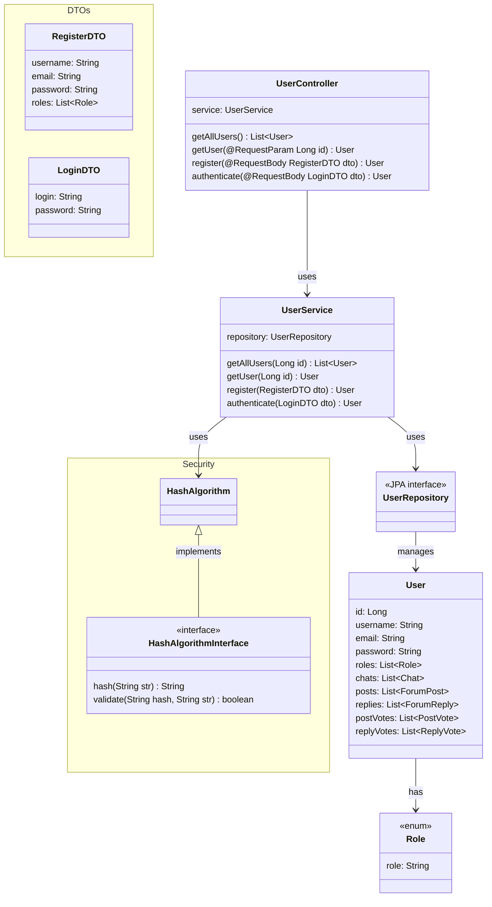

# Diagrama de Classes
## User Domain

**Casos de Uso Associados:** UC01, UC02;

**Funcionalidades:** cadastro e autenticação de usuários.

> [!NOTE]
> Algumas funções, como edição e deleção não serão implementadas nesse primeiro momento por uma dependência do Spring Security que ainda será abordada e trabalhada em sala de aula.

