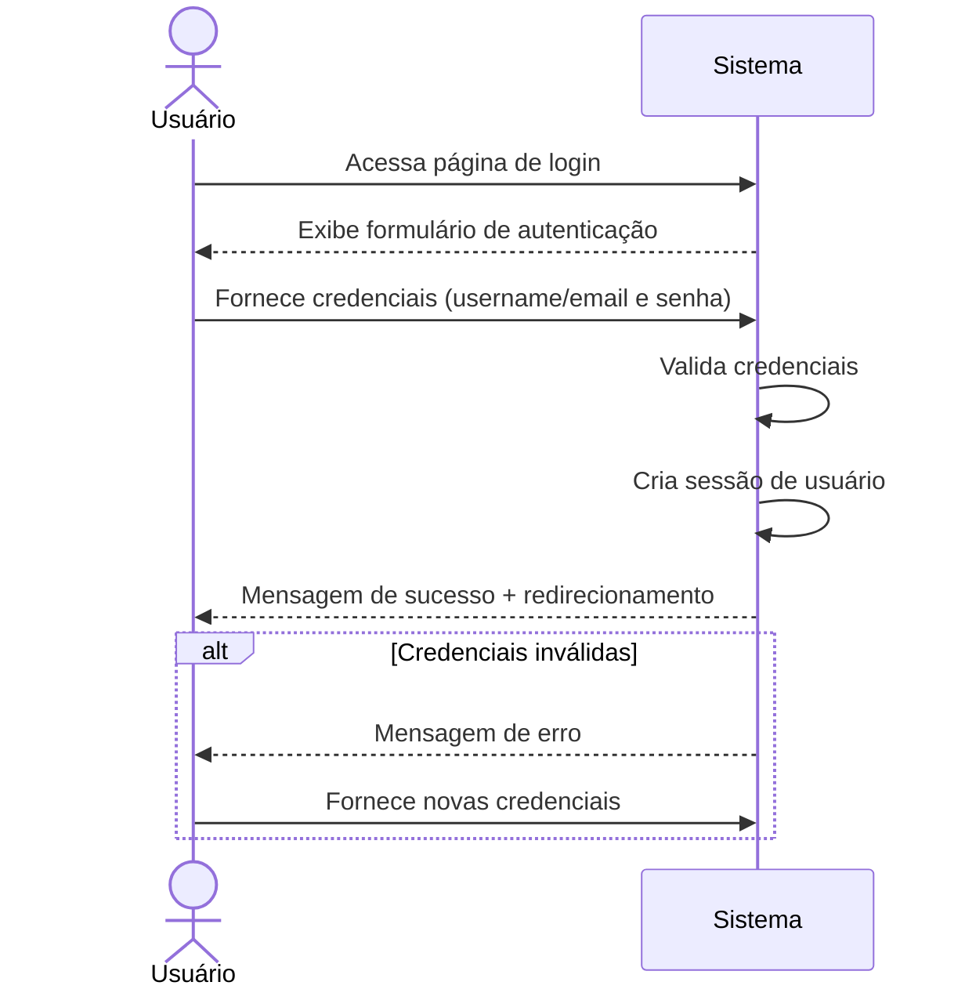

# Diagrama de Sequêncoa
## Autenticação de Usuário

```mermaid
sequenceDiagram
    actor Usuário
    participant Sistema

    Usuário->>Sistema: Acessa página de login
    Sistema-->>Usuário: Exibe formulário de autenticação
    
    Usuário->>Sistema: Fornece credenciais (username/email e senha)
    Sistema->>Sistema: Valida credenciais
    Sistema->>Sistema: Cria sessão de usuário
    Sistema-->>Usuário: Mensagem de sucesso + redirecionamento

    alt Credenciais inválidas
        Sistema-->>Usuário: Mensagem de erro
        Usuário->>Sistema: Fornece novas credenciais
    end
  
```