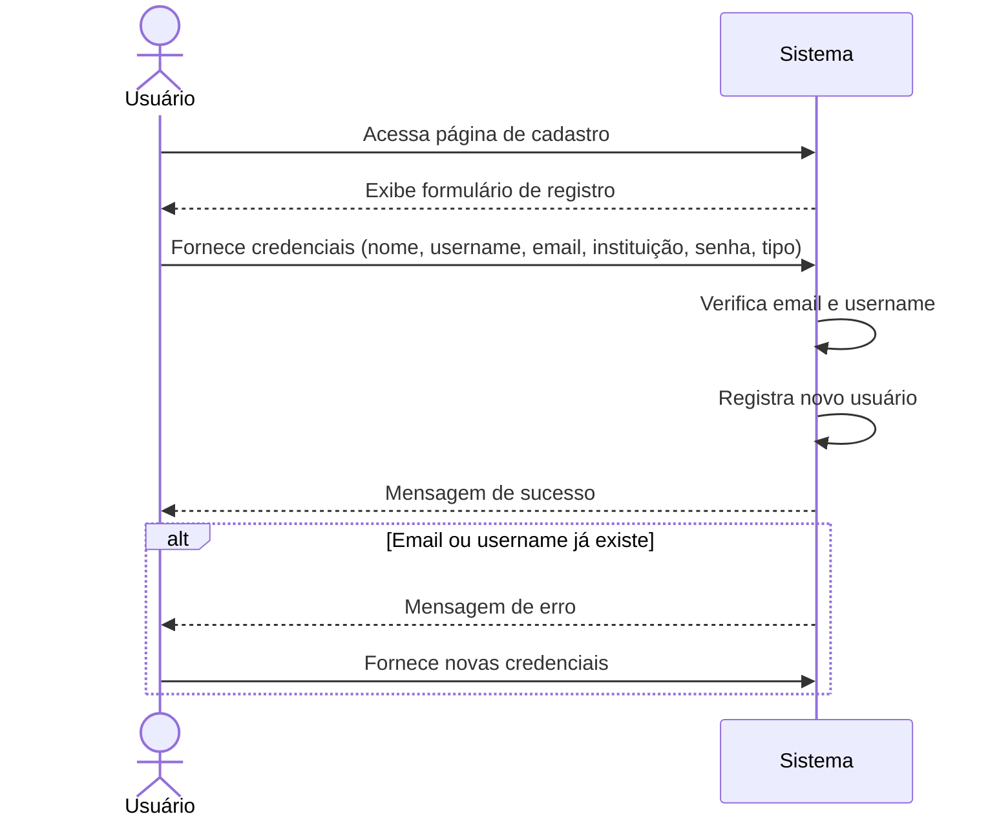

# Diagrama de Sequêncoa
## Cadastro de Usuário

```mermaid
sequenceDiagram
    actor Usuário
    participant Sistema

    Usuário->>Sistema: Acessa página de cadastro
    Sistema-->>Usuário: Exibe formulário de registro


    Usuário->>Sistema: Fornece credenciais (nome, username, email, instituição, senha, tipo)
    Sistema->>Sistema: Verifica email e username
    Sistema->>Sistema: Registra novo usuário
    Sistema-->>Usuário: Mensagem de sucesso
    alt Email ou username já existe
        Sistema-->>Usuário: Mensagem de erro
        Usuário->>Sistema: Fornece novas credenciais
    end

```