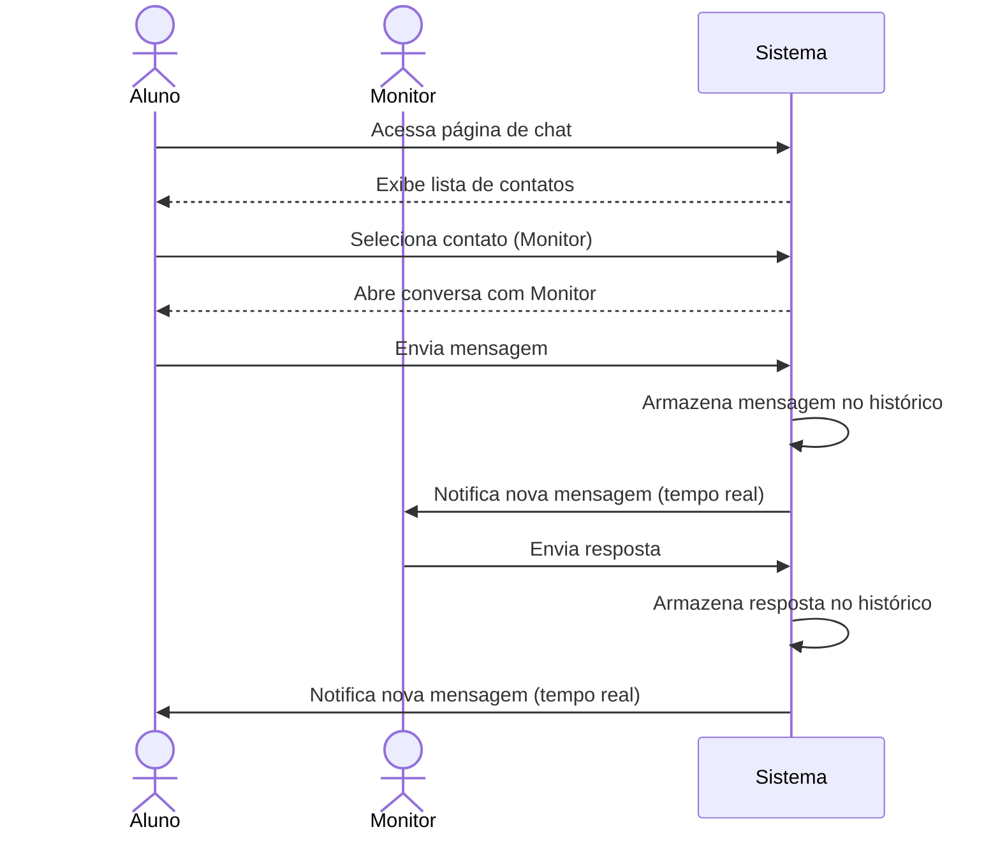

# Diagrama de Sequêncoa
## Comunicação via Chat

```mermaid
sequenceDiagram
    actor Aluno as Aluno
    actor Monitor as Monitor
    participant Sistema

    Aluno->>Sistema: Acessa página de chat
    Sistema-->>Aluno: Exibe lista de contatos
    
    Aluno->>Sistema: Seleciona contato (Monitor)
    Sistema-->>Aluno: Abre conversa com Monitor

    
    Aluno->>Sistema: Envia mensagem
    Sistema->>Sistema: Armazena mensagem no histórico
    Sistema->>Monitor: Notifica nova mensagem (tempo real)
    
    Monitor->>Sistema: Envia resposta
    Sistema->>Sistema: Armazena resposta no histórico
    Sistema->>Aluno: Notifica nova mensagem (tempo real)
    
```